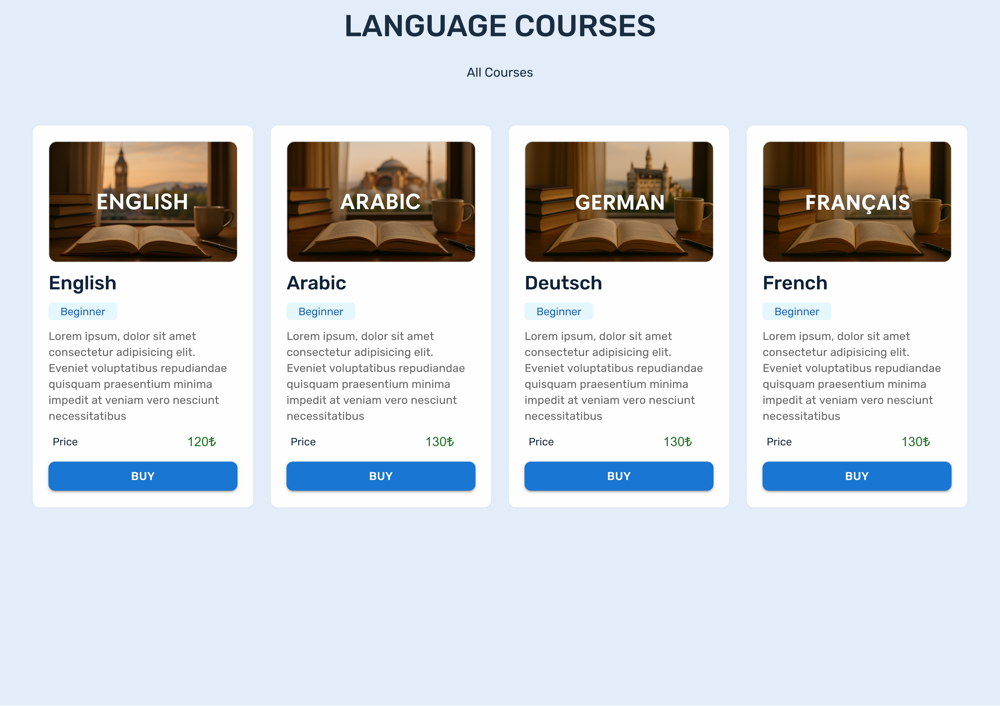

# My Courses App

A simple React application that displays language courses (English, Arabic, French, German) using Material UI cards.
Each course includes an image, description, and price.

This is a simple-mini courses application. It prepared using React and Material UI. There are cards that list language courses. And each course includes an image, description, and price



## Features

- List of language courses using MUI cards
- Google Fonts & Font Awesome integration
- Mobile responsive design with CSS and media queries
- Clean layout and accessible UI elements


## Tech Stack

- React
- Vite
- Material UI
- Google Fonts
- CSS (with media queries)


## Installation

To run this project locally:

```bash
1. Clone the repository:
git clone https://github.com/Rumeysa-koseoglu/course-app

2. Move into the project directory
cd course-app

3. Install dependencies
npm install

4. Start the development server    
npm run dev
```

    Then visit http://localhost:5137 in your browser


## What I Learned

--With this project I learned

- How to use Material UI components like Card and Typography
- Applying responsive design
- Styling with `sx` and custom CSS
- Structuring a React project and managing props
- Writing meaningful Git commit messages


## About Me
I built this app as a practice project while learning React and Material UI.

